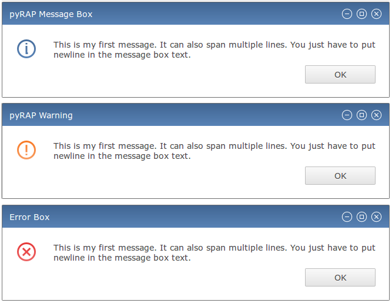
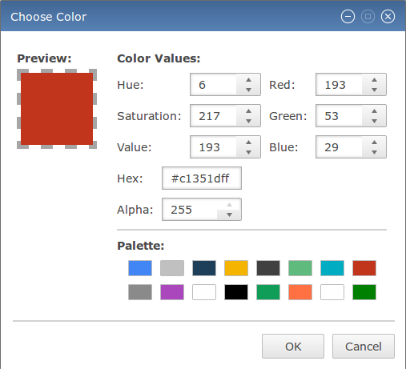

Advanced Topics
===============

Standard Dialogs
----------------

`pyRAP` provides a selection of standard dialogs, which allow convenient interaction with the user.

Message Boxes
~~~~~~~~~~~~~

The purpose of message boxes is to inform the user about facts that need to be acknowledged by hitting an
"OK" button. There are shortcuts for three kinds of messages available, which are indicated by different icons.

.. autofunction:: pyrap.dialogs.msg_ok

   Three message boxes available in pyRAP: ``msg_ok``, ``msg_warn``, and ``msg_err``.

Color Chooser
~~~~~~~~~~~~~

   The pyRAP dialog for choosing colors.

Push Sessions
-------------

Multithreading
--------------
