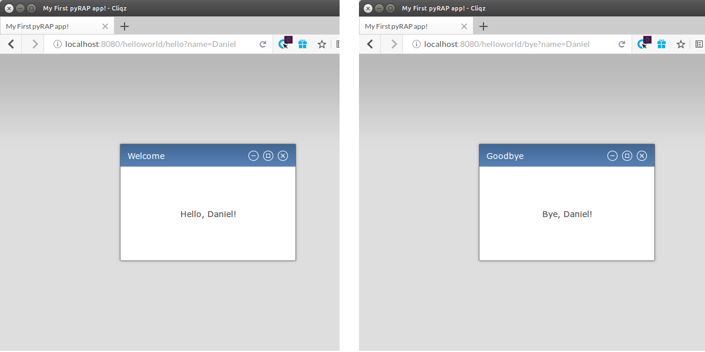

Introduction
============

Installation
~~~~~~~~~~~~

Checkout the git repository from ::

    git clone https://github.com/danielnyga/pyrap.git

Make sure that the `pyRAP` source directory is in your ``PYTHONPATH`` variable. Depending on
whether you use Python 2 or Python 3, choose either ``pyrap/python2`` or ``pyrap/python3``. ::

    export PYTHONPATH=/path/to/pyrap/(python2|pythoon3):$PYTHONPATH

You may additionally want to install the dependencies from the ``requirements.txt``: ::

    pip install -r (python2|python3)/requirements.txt

Hello, pyRAP!
~~~~~~~~~~~~~

pyRAP has been designed to keep the amount of boilerplate code at a mininum. A minimalistic example application
is the following.

.. code-block:: python
    :linenos:

    import pyrap
    from pyrap.widgets import Shell, Label

    class HelloWorld:
        '''My pyRAP application'''

        def main(self, **kwargs):
            shell = Shell(title='Welcome to pyRAP', minwidth=300, minheight=200)
            Label(shell.content, 'Hello, world!')
            shell.on_resize += shell.dolayout
            shell.show(pack=True)

    if __name__ == '__main__':
        pyrap.register(name='My First pyRAP app!',
                       clazz=HelloWorld,
                       entrypoints={'start': HelloWorld.main},
                       path='helloworld')
        pyrap.run()

Save this piece of code in a file named ``helloworld.py`` and run it 
either from the command line with ::

    python helloworld.py

or from within your favorite Python IDE. If the program immediately terminates
with a ``socket.error: [Errno 98] Address already in use``, then please
make sure that no other process is currently using port 8080 on your
local machine. Having started the app, open a browser and navigate to
``http://localhost:8080/helloworld`` and you will see a window in the
content area of the browser displaying the message "Hello, world!"
like so:

.. figure:: _static/helloworld.png

   Screenshot of the ``helloworld.py`` pyRAP app.

Before stepping into details of our example, it is worth stopping for a 
moment and making yourself familiar with the result. Given that our app 
comprises only a few lines of code, it already provides quite some 
functionality that comes with pyRAP. Indeed, the window that pyRAP
created mimics the look-and-feel of that of native windows of any 
operating system supporting graphical user interfaces, like Windows, 
Linux or OS X. Try dragging the window around, maximizing it by hitting 
the `Maximize` button or double clicking on the title bar, and resizing
it by dragging its borders. 

.. note::

    When you hit the `Minimize` or `Close` button, the window will 
    disappear. In our simple application, it will be gone forever since 
    we have not implemented any mechanism to restore it. You can 
    restart the app by refreshing the browser page or hitting `F5`.
    
Let us walk through the code of the "Hello, world!" application.
Lines 5-12 represent the definition of the main class of our application.
This class represents the interface of our app to the pyRAP framework
and contains the code for one single executable instance of the app.
For any user accessing the app via their browser, pyRAP will create a
new instance of this class and attach it to the HTTP user session of
the client. After a new runtime object of the main class has been instantiated,
pyRAP calls its main entry point, i.e. the ``main`` method in our
example (this method is not required to be called ``main``). The remainder
of the ``main`` method is self-explanatory:

  * Line 8 creates the main window ``shell`` of our app with the title "Welcome to pyRAP",
    which has a minimum width of 300 pixels and a maximum height of 200 pixels.

  * Line 10 creates a label widget and adds it to the content area of
    the main window, and assigns it the text "Hello, world!"

  * Line 11 give a first glance at event handling in pyRAP: It adds to
    the ``on_resize`` event of the main shell a reference to its
    ``dolayout`` method. As an effect, the ``dolayout`` method of the shell
    will be invoked whenever a user resizes the window.

  * Line 12 computes the initial layout of the main shell and finally
    displays it on the screen. The ``pack=True`` argument of causes the
    layout algorithm to make the window as compact and nice-looking as
    possible.

The ``__main__`` section of the ``helloworld.py`` module eventually
registers the "Hello, world" app at the pyRAP server and starts the server process.
It registers ``HelloWorld`` as the main class of the application, specifies
the name of the app which is supposed to appear in the browser's title bar and
maps an entrypoint with the name ``"start"`` to its ``main`` method.
Finally, it makes the app publicly available under the path ``helloworld``.

Calling a pyRAP App
~~~~~~~~~~~~~~~~~~~

Any pyRAP app can be accessed from a browser via a URL having the following scheme: ::

    http[s]://{host}[:{port}]/{path}/{entrypoint}[?{kwargs}]

Explanation:

  * ``host``: hostname or IP address

  * ``port``: (optional) port

  * ``path``: the path under which the app has been configured in ``pyrap.register`` to be
    accessible.

  * ``entrypoint``: (optional) The entrypoint (or "main" method) to be called after a new instance of the app class
    has been instantiated. Entrypoints can be mapped to class method references in the ``entrypoints`` parameters
    of ``pyrap.register``. It is possible to specify multiple entry poitns per app. For example,
    different entrypoints for desktop and mobile devices can may be given. If multiple entrypoints have been specified
    in ``pyrap.register``, a default entrypoint can be given with the ``default`` argument of ``pyrap.register``.
    If this part of the URL scheme is skipped, this ``default`` entry is called.

  * ``kwargs``: Optionally, the entrypoint name may be followed by an HTTP query string representing ``key=value``
    pairs of keyword arguments, which will be passed to the entry point method as parameters. The key/value pairs
    must be separated by ``&``, preceded by ``?`` and escaped.

Example
-------

.. code-block:: python
    :linenos:

    class SayHello:
        '''My pyRAP application'''

        def msg(self, title, text):
            shell = Shell(title=title, minwidth=300, minheight=200)
            Label(shell.content, text=text)
            shell.on_resize += shell.dolayout
            shell.show(True)

        def hello(self, **kwargs):
            self.msg('Welcome', 'Hello, %s!' % kwargs.get('name', 'world'))

        def bye(self, **kwargs):
            self.msg('Goodbye', 'Bye, %s!' % kwargs.get('name', 'world'))

    if __name__ == '__main__':
        pyrap.register(clazz=SayHello,
                       entrypoints={'hello': SayHello.hello, 'bye': SayHello.bye},
                       default='hello',
                       path='helloworld',
                       name='My First pyRAP app!')
        pyrap.run()

   Screenshot of the exemplary app when being called with different entrypoints.
