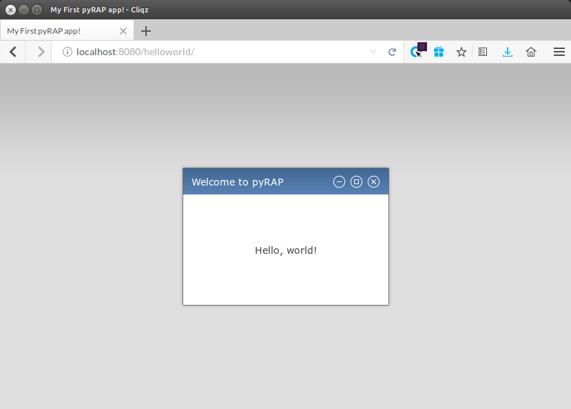

Introduction
============

First Steps
-----------

Installation
~~~~~~~~~~~~

Here come some installation instructions. Make sure that the pyRAP
base directory is your ``PYTHONPATH`` variable. That's it.

Hello, pyRAP!
~~~~~~~~~~~~~

pyRAP has been designed to keep the amount of boilerplate code that
you have to write at a mininum. A minimalistic example application
is the following.::

    import pyrap
    from pyrap.widgets import Shell, Label

    class HelloWorld(object):
        def main(self, display, **kwargs):
            self.shell = Shell(display, title='Hello, pyRAP!', resize=True, btnclose=True, btnmin=True, btnmax=True)
            self.label = Label(self.shell.content, 'Hello, world!')
            self.shell.on_resize += self.shell.dolayout
            self.shell.dolayout(True)

    if __name__ == '__main__':
        pyrap.register_app(clazz=HelloWorld, 
                           entrypoints={'hello': HelloWorld.main},
                           default='hello',
                           path='hello', 
                           name='My First pyRAP app!')
        pyrap.run()

Save this piece of code in a file named ``helloworld.py`` and run it 
either from the command line with ``python helloworld.py`` or from
within your favorite Python IDE. If the programm immediately terminates
with a ``socket.error: [Errno 98] Address already in use``, then please
make sure that no other process is currently using port 8080 on your
local machine. Having started the app, open a browser and navigate to
``http://localhost:8080/hello`` and you will see a window in the 
content area of the browser displaying the message "Hello, world!"
like so:

   Screenshot of the ``helloworld.py`` pyRAP app.
   
Before stepping into details of our example, it is worth stopping for a 
moment and making yourself familiar with the result. Given that our app 
comprises only a few lines of code, it already provides quite some 
functionality that comes with pyRAP. Indeed, that window that pyRAP 
created mimics the look-and-feel of that of native windows of any 
operating system supporting graphical user interfaces, like Windows, 
Linux or OS X. Try dragging the window around, maximizing it by hitting 
the `Maximize` button or double clicking on the title bar, and resizing
it by dragging its borders. 

.. warning:: 

    When you hit the `Minimize` or `Close` button, the window will 
    disappear. In our simple application, it will be gone forever since 
    we have not implemented any mechanism to restore it. You can 
    restart the app by refreshing the browser page or hitting `F5`.
    
    
    
    
    
